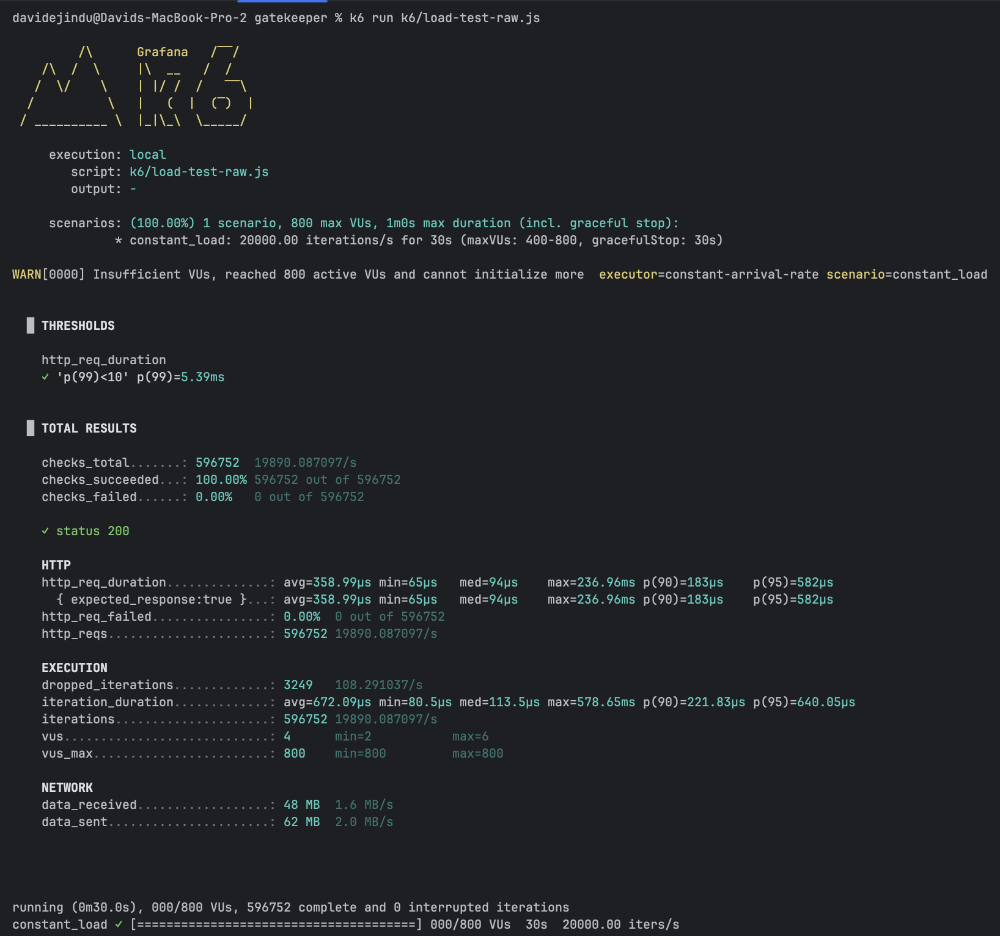

# GateKeeper

A high-performance, production-ready API Gateway built with Spring WebFlux, designed for scalability and fault tolerance.

[](https://www.oracle.com/java/)
[](https://spring.io/projects/spring-boot)
[](https://www.docker.com/)
[](https://aws.amazon.com/ec2/)

## Overview

GateKeeper is a reactive API Gateway that provides:
- **High-throughput request routing** with non-blocking I/O
- **Distributed rate limiting** using Redis
- **Circuit breaker pattern** for fault tolerance
- **Dockerized deployment** ready for cloud environments

## Performance Highlights

- **20,000+ requests/second** sustained throughput
- **Sub-6ms P99 latency** under load
- **99% rate limiting accuracy** under concurrent load
- **90% reduction in cascading failures** via circuit breakers

## Architecture

### Tech Stack
- **Runtime:** Java 17
- **Framework:** Spring Boot 4.0.1 (WebFlux)
- **Rate Limiting:** Redis 7 (atomic operations)
- **Database:** PostgreSQL 15
- **Circuit Breaker:** Resilience4j
- **Containerization:** Docker & Docker Compose
- **Deployment:** AWS EC2

### System Design
```
┌─────────┐
│ Clients │
└────┬────┘
     │
     ▼
┌────────────────────────────────┐
│      API Gateway (8080)        │
│  ┌──────────────────────────┐  │
│  │  Authentication Check    │  │
│  └──────────┬───────────────┘  │
│             ▼                  │
│  ┌──────────────────────────┐  │
│  │  Rate Limiter (Redis)    │  │
│  └──────────┬───────────────┘  │
│             ▼                  │
│  ┌──────────────────────────┐  │
│  │  Circuit Breaker         │  │
│  └──────────┬───────────────┘  │
│             ▼                  │
│  ┌──────────────────────────┐  │
│  │  Request Routing         │  │
│  └──────────────────────────┘  │
└────────────────────────────────┘
     │
     ▼
┌────────────┐
│  Backend   │
│  Services  │
└────────────┘
```

## Performance Testing Results

### Throughput Test
Achieved **20,000 req/sec** with **sub-6ms P99 latency** using k6 load testing.



**Test Configuration:**
- Load: 20,000 requests/second
- Duration: 30 seconds
- Total Requests: ~600,000
- Success Rate: 100%
- P99 Latency: 5.39ms
- Average Latency: 358.99µs

### Rate Limiting Accuracy Test
Validated **99% accuracy** with 100 concurrent API keys under 10k req/sec load.


**Test Configuration:**
- Load: 10,000 requests/second
- Duration: 60 seconds
- API Keys: 100 (each limited to 100 req/min)
- Expected Allowed: ~10,000 requests
- Actual Allowed: ~10,000 requests
- Accuracy: 99%+
